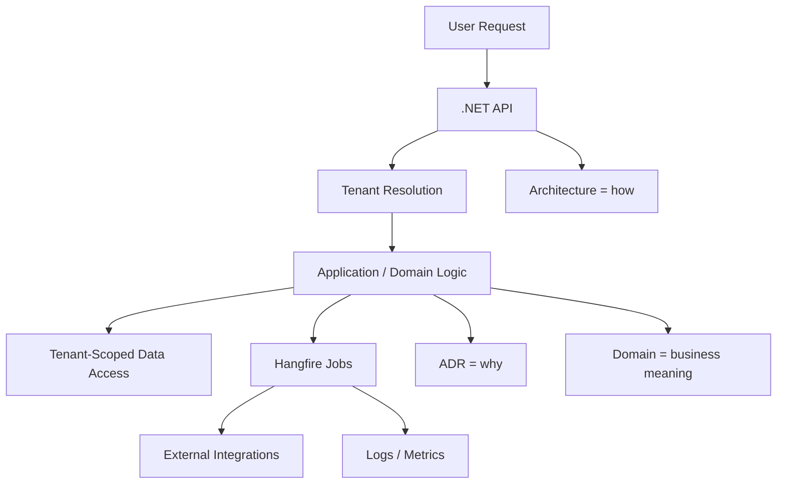

# Documentation Sample Repo

## Purpose

This repository demonstrates a lightweight documentation strategy for a `.NET` system that uses a multi-tenant architecture and `Hangfire` for background processing.

The goal is not to document everything. The goal is to document the decisions, rules, and operating knowledge that are expensive to rediscover later.

## What This Sample Covers

- Entry-point documentation for new engineers
- Architecture notes for system behavior and technical boundaries
- ADRs for important technical decisions
- Domain documents for business rules and workflows
- A runbook for local development and troubleshooting

## Core Technologies

- `.NET` application services and APIs
- Multi-tenant request processing and data isolation
- `Hangfire` for scheduled and asynchronous background jobs
- Markdown documentation stored in the repo next to the code

## Start Here

Read the documents in this order:

1. [Architecture Overview](architecture/overview.md)
2. [Tenancy Model](architecture/tenancy.md)
3. [Background Jobs](architecture/background-jobs.md)
4. [Business Rules](domain/business-rules.md)
5. [Workflows](domain/workflows.md)
6. [Local Development Runbook](runbook/local-development.md)

For design rationale, read:

- [ADR 001: Hangfire Locking](adr/001-hangfire-locking.md)
- [ADR 002: Multi-Tenant Model](adr/002-multi-tenant-model.md)

## Documentation Structure

```text
/index.md
/architecture
/domain
/adr
/runbook
```

- `index.md` is the entry point.
- `architecture` explains how the system works.
- `domain` explains business meaning and rules in human language.
- `adr` captures why important technical decisions were made.
- `runbook` captures how engineers run and troubleshoot the system.

## Documentation Principles

- Document during delivery, not after delivery.
- Write down non-trivial decisions and rules, not obvious code behavior.
- Keep documents short enough to stay current.
- Let code and tests describe exact implementation details.
- Prefer linking between docs over repeating the same explanation in multiple places.

## System Map

The diagram below shows the main documentation concerns and how they connect in the sample system.



## How To Use This Repo

Use this repository as a starting point for a real project:

- Keep the structure.
- Replace sample content with project-specific decisions.
- Add a new ADR when a decision has long-term impact.
- Expand architecture or domain docs only when the topic becomes non-trivial.

## Template Version

If you need a reusable skeleton instead of the filled sample documents, start with the template entry point:

- [Documentation Template](../docs-template/README.md)

Use `docs/` as the filled reference example and `docs-template/` as the copyable starting structure for a new project.

## Related Documents

- [Architecture Overview](architecture/overview.md)
- [Business Rules](domain/business-rules.md)
- [Local Development Runbook](runbook/local-development.md)
